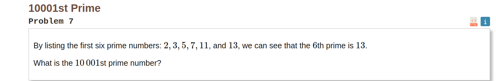
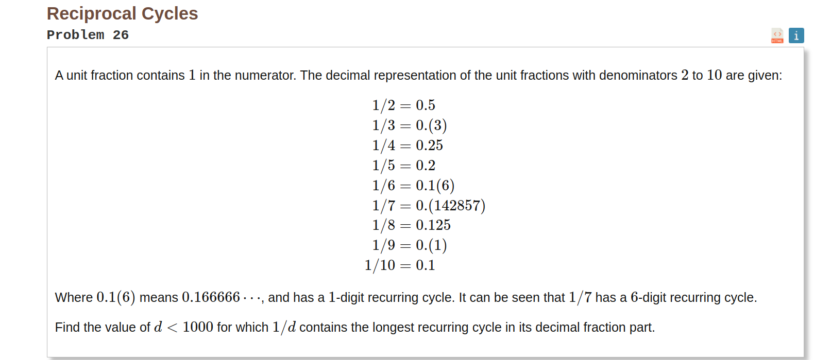

## Выполнил

- ФИО:`Нягин Михаил Алексеевич`
- ISU_ID:`368601`
- Группа:`P3313`
- Вариант 7,26

## Задание 7


## Задание 26



## Номер 7
1. Монолитная реализации с использованием рекурсии и ее хвостовой оптимизацией
```elixir
# хвостовая рекурсия
defmodule PrimeFinderWithTailCalling do
  def find_nth_prime(n), do: find_prime(n, 2, 0)

  defp find_prime(target_count, current_number, prime_count) when prime_count == target_count,
    do: current_number - 1

  defp find_prime(target_count, current_number, prime_count) do
    if prime_count == target_count do
      current_number - 1
    else
      if is_prime(current_number) do
        find_prime(target_count, current_number + 1, prime_count + 1)
      else
        find_prime(target_count, current_number + 1, prime_count)
      end
    end
  end

  def is_prime(number) when number > 2, do: check_prime(number, 2)
  def is_prime(2), do: true
  def is_prime(_), do: false

  defp check_prime(number, divider) when divider * divider > number, do: true

  defp check_prime(number, divider) when rem(number, divider) == 0, do: false
  defp check_prime(number, divider), do: check_prime(number, divider + 1)
end

# Найдем 10001-е простое число
defmodule PrimeFinderWithoutOptimization do
  def find_nth_prime(n) do
    find_prime(2, n, 0)
  end

  defp find_prime(current_number, target_count, prime_count) do
    if prime_count == target_count do
      current_number - 1
    else
      if is_prime(current_number) do
        next_prime = find_prime(current_number + 1, target_count, prime_count + 1)
        next_prime
      else
        next_prime = find_prime(current_number + 1, target_count, prime_count)
        next_prime
      end
    end
  end

  defp is_prime(2), do: true

  defp is_prime(number) when number > 1 do
    check_prime(number, 2)
  end

  defp is_prime(_), do: false

  defp check_prime(number, divisor) when divisor * divisor > number, do: true

  defp check_prime(number, divisor) do
    if rem(number, divisor) == 0 do
      false
    else
      next_check = check_prime(number, divisor + 1)
      next_check
    end
  end
end

IO.inspect(PrimeFinderWithTailCalling.find_nth_prime(1000001))
IO.inspect(PrimeFinderWithoutOptimization.find_nth_prime(1000001))

```

2. С модульной реализации, где явно разделена генерация последовательности, фильтрация и свёртка (должны использоваться функции reduce/fold, filter и аналогичные);


```Elixir 
defmodule PrimeModularWithReduce do
  def find_nth_prime(n) do
    Stream.iterate(2, &(&1 + 1))
    |> Stream.filter(&is_prime/1)
    |> Enum.take(n)
    |> List.last()
  end

  defp is_prime(2), do: true

  defp is_prime(number) when number > 1 do
    check_prime(number, 2)
  end

  defp is_prime(_), do: false

  defp check_prime(number, divisor) when divisor * divisor > number, do: true

  defp check_prime(number, divisor) do
    if rem(number, divisor) == 0 do
      false
    else
      next_check = check_prime(number, divisor + 1)
      next_check
    end
  end
end
IO.inspect(PrimeModularWithReduce.find_nth_prime(1000001))
```


3. генерация последовательности при помощи отображения (map)
```Elixir
defmodule PrimeWithMap do
  def find_nth_prime(n) do
    Stream.iterate(2, &(&1 + 1))
    |> Stream.filter(&is_prime/1)
    |> Enum.take(n)
    |> Enum.map(&(&1))
    |> List.last()
  end

  defp is_prime(2), do: true

  defp is_prime(number) when number > 1 do
    check_prime(number, 2)
  end

  defp is_prime(_), do: false

  defp check_prime(number, divisor) when divisor * divisor > number, do: true

  defp check_prime(number, divisor) do
    if rem(number, divisor) == 0 do
      false
    else
      next_check = check_prime(number, divisor + 1)
      next_check
    end
  end
end
IO.inspect(PrimeWithMap.find_nth_prime(1000001))
```

4. работа со спец. синтаксисом для циклов (где применимо)
```elixir
defmodule PrimeWithFor do
  def find_nth_prime(n) do
    primes = for num <- 2..164_858_67, is_prime(num), do: num
    Enum.at(primes, n - 1)
  end

  defp is_prime(2), do: true

  defp is_prime(number) when number > 1 do
    check_prime(number, 2)
  end

  defp is_prime(_), do: false

  defp check_prime(number, divisor) when divisor * divisor > number, do: true

  defp check_prime(number, divisor) do
    if rem(number, divisor) == 0 do
      false
    else
      next_check = check_prime(number, divisor + 1)
      next_check
    end
  end
end
IO.inspect(PrimeWithFor.find_nth_prime(1000001))
```

5. Реализация на любом удобном для вас традиционном языке программирования для сравнения.
```Go
package main

import (
	"fmt"
	"math"
)

func isPrime(number int) bool {
	if number < 2 {
		return false
	}
	for i := 2; i <= int(math.Sqrt(float64(number))); i++ {
		if number%i == 0 {
			return false
		}
	}
	return true
}

func findNthPrime(n int) int {
	count := 0
	num := 1
	for count < n {
		num++
		if isPrime(num) {
			count++
		}
	}
	return num
}

func main() {
	var input int
	fmt.Scan(&input)
	nthPrime := findNthPrime(input)
	fmt.Println(nthPrime)
}

```


## Задание 26
1.монолитные реализации с использованием рекурсии

```Elixir
defmodule RecurringCycle do
  def longest_cycle(limit), do: find_longest_cycle(limit, 2, 0, 0)

  defp find_longest_cycle(1, _, longest_d, _), do: longest_d

  defp find_longest_cycle(d, current_longest, longest_d, _) when d >= 2 do
    length = cycle_length(d)
    if length > current_longest do
      find_longest_cycle(d - 1, length, d, length)
    else
      find_longest_cycle(d - 1, current_longest, longest_d, length)
    end
  end

  defp cycle_length(d), do: calculate_length(d, 1, 0, %{})

  defp calculate_length(_, 0, _, _), do: 0
  defp calculate_length(d, remainder, position, remainders) do
    case Map.get(remainders, remainder) do
      nil ->
        new_remainders = Map.put(remainders, remainder, position)
        calculate_length(d, rem(remainder * 10, d), position + 1, new_remainders)

      prev_position ->
        position - prev_position
    end
  end
end

defmodule RecurringCycleWithoutOptimization do
  def longest_cycle(limit), do: find_longest_cycle(limit, 0, 0)

  defp find_longest_cycle(1, _, longest_d), do: longest_d
  defp find_longest_cycle(d, current_longest, longest_d) do
    length = cycle_length(d)
    if length > current_longest do
      find_longest_cycle(d - 1, length, d)
    else
      find_longest_cycle(d - 1, current_longest, longest_d)
    end
  end

  defp cycle_length(d), do: calculate_length(d, 1, 0, %{})

  defp calculate_length(_, 0, _, _), do: 0
  defp calculate_length(d, remainder, position, remainders) do
    case Map.get(remainders, remainder) do
      nil ->
        new_remainders = Map.put(remainders, remainder, position)
        nextCalc = calculate_length(d, rem(remainder * 10, d), position + 1, new_remainders)
        nextCalc
      prev_position ->
        position - prev_position
    end
  end
end


IO.inspect(RecurringCycleWithoutOptimization.longest_cycle(1000))
IO.inspect(RecurringCycle.longest_cycle(1000))

```

2. С модульной реализации, где явно разделена генерация последовательности, фильтрация и свёртка (должны использоваться функции reduce/fold, filter и аналогичные);
```Elixir 
defmodule RecurringCycle do
  def longest_cycle(limit) do
    2..limit
    |> Enum.map(&{&1, cycle_length(&1)})
    |> Enum.filter(fn {_, len} -> len > 0 end)
    |> Enum.max_by(fn {_, len} -> len end)
    |> elem(0)
  end

  defp cycle_length(d), do: calculate_length(d, 1, 0, %{})

  defp calculate_length(_, 0, _, _), do: 0
  defp calculate_length(d, remainder, position, remainders) do
    case Map.get(remainders, remainder) do
      nil ->
        new_remainders = Map.put(remainders, remainder, position)
        calculate_length(d, rem(remainder * 10, d), position + 1, new_remainders)

      prev_position ->
        position - prev_position
    end
  end
end
IO.inspect(RecurringCycle.longest_cycle(1000))
```


3. генерация последовательности при помощи отображения (map)

```Elixir
defmodule RecurringCycle do
  def longest_cycle(limit) do
    2..limit
    |> Enum.map(&{&1, cycle_length(&1)})
    |> Enum.max_by(fn {_, length} -> length end)
    |> elem(0)
  end

  defp cycle_length(d), do: calculate_length(d, 1, 0, %{})

  defp calculate_length(_, 0, _, _), do: 0
  defp calculate_length(d, remainder, position, remainders) do
    case Map.get(remainders, remainder) do
      nil ->
        new_remainders = Map.put(remainders, remainder, position)
        calculate_length(d, rem(remainder * 10, d), position + 1, new_remainders)

      prev_position ->
        position - prev_position
    end
  end
end
IO.inspect(RecurringCycle.longest_cycle(1000))

```

4. работа с бесконечными списками для языков, поддерживающих ленивые коллекции или итераторы как часть языка 
``` Elixir
defmodule RecurringCycle do
  def longest_cycle(limit) do
    Stream.iterate(2, &(&1 + 1))
    |> Stream.map(&{&1, cycle_length(&1)})
    |> Enum.take(limit - 1)
    |> Enum.max_by(fn {_, len} -> len end)
    |> elem(0)
  end

  defp cycle_length(d), do: calculate_length(d, 1, 0, %{})

  defp calculate_length(_, 0, _, _), do: 0
  defp calculate_length(d, remainder, position, remainders) do
    case Map.get(remainders, remainder) do
      nil ->
        new_remainders = Map.put(remainders, remainder, position)
        calculate_length(d, rem(remainder * 10, d), position + 1, new_remainders)

      prev_position ->
        position - prev_position
    end
  end
end
IO.inspect(RecurringCycle.longest_cycle(1000))
```

5. реализация на любом удобном для вас традиционном языке программирования для сравнения

```go
package main

import (
	"fmt"
)

func recurringCycleLength(d int) int {
	remainders := make(map[int]int)
	remainder := 1 % d
	position := 0

	for remainder != 0 {
		if pos, found := remainders[remainder]; found {
			return position - pos
		}
		remainders[remainder] = position
		remainder = (remainder * 10) % d
		position++
	}
	return 0
}

func main() {
	longest := 0
	dWithLongestCycle := 0

	for d := 2; d < 1000; d++ {
		length := recurringCycleLength(d)
		if length > longest {
			longest = length
			dWithLongestCycle = d
		}
	}

	fmt.Printf("Ans: %d\n", dWithLongestCycle)
}

```
# Выводы

Крайне непривычно повсеместно использовать рекурсию вместо обыкновенных циклов, однако за счет Pattern Matching и прочих удобных инструментов становится не только быстро в написании, но и понятно как в императивных языках